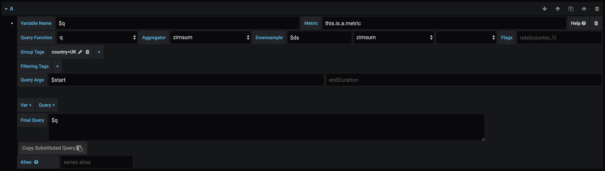

## Bosun app

The Bosun app currently provides a datasource for Bosun, and a panel to list open incidents. This plugin replaces the datasource plugin.

## Bosun datasource
Bosun datasource plugin for Grafana 3.0 and later

This plugin turns [Bosun](http://bosun.org) into a datasource for Grafana 3.0 and later. This means you can use any [Bosun expression](http://bosun.org/expressions) to generate cool dashboards which are not possible with OpenTSDB alone.

### Usage

The datasource provides 2 special variables that make easier to integrate the expressions in Grafana:
* $ds - the suggested downsampling interval for use in your queries
* $start - it's replaced by the starting time selected by the user in Grafana

Sample code to generate percent of free space for each partition:

```
$free = q("avg:$ds-avg:os.disk.fs.space_free{disk=*,host=backup}", "$start", "")
$total = q("avg:$ds-avg:os.disk.fs.space_total{disk=*,host=backup}", "$start", "")
$free / $total
```


Aliases can make use of variables in the format ```$tag_<tagname>``` to use the timeseries' respective tag values on legend. On the above example we use ```$tag_disk``` and ```$tag_host```

It's also possible to use any other templated variable in your queries, the same way it's possible on other datasources


### Templating
The following functions can be used in a query for template variables:
* tagvalues(metric.name, tagname):  ```tagvalues(os.load, host)```
* tagkeys(metric.name): ```tagkeys(os.load)```


### Annotations
Grafana can display annotations created inside Bosun, which may add more context to strange metrics behaviour.


They can be filtered by any of the fields available in Bosun, and will be displayed like a standard annotation in Grafana.


### Query helper
If you use Bosun to index data from OpenTSDB, it's possible to enable the Query Helper on data source configuration.


Doing that enables a helper tool that is able to generate queries using metadata from Bosun. This makes it a lot easier to write your expressions.

## Incident List
The plugin includes a custom panel that enable Grafana users to interact with Bosun incidents.


You can query Bosun and display only incidents related to other information displayed on the dashboard, filtering by tags keys/value, incident status (Normal, Warning, Critical), alert name, among other fields. The user can then interact with incidents just like inside Bosun, taking actions and checking alert history.


The complete incident body can be shown without ever leaving the dashboard:


## External Dependencies

Besides Grafana, the plugin just needs a running Bosun instance. Because Bosun doesn't have support for [CORS headers](https://en.wikipedia.org/wiki/Cross-origin_resource_sharing), it may be easier to make it work in proxy mode.
Bosun also needs a ElasticSearch backend in order for its annotations subsystem to work.

## Query Templating

For users unfamiliar with Bosun syntax, or for rapid prototyping, query template blocks can be used.

Simply click the Query + button and a new query block will appear.



In the above example the query

`
q("zimsum:$ds-:this.is.a.metric{country=UK}{}", "$start", "")
`

is templated. The variable name is given as $q - variable names must be prepended with a dollar. This can then be called in the Final Query section.

If we wished to also make the value for the country tag a templated variable then we could click the Var + button. This adds a new simple variable block at the bottom. Blocks are read and their variables substituted in order, so to use this new $country block we can click and drag it above the query block.
This is shown in the gif below, beginning from the query shown above. The resulting query will be functionally equivalent.


The free text box still works as before and no templating is required, templated variables and queries are just substituted in when referenced with their name - where the name begins with $.

You can copy the substituted query straight to your clipboard with the 'copy substituted query' button - useful for building a Bosun query string without worrying about the syntax.
 
## Local Development

Clone Grafana. 

Clone this repo into Grafana's plugins folder.

Run `npm install -g grunt-cli`

Add the following to datasources.yml in Grafana to provide the plugin with a suitable datasource:
```
  - name: Bosun
    type: bosun-datasource
    access: proxy
    url: <Bosun URL>
    jsonData:
      openTSDBUrl: <OpenTSDB URL>
```
Autocompletion suggestions for metrics are taken from the OpenTSDB instance addressed by the provided openTSDBUrl parameter. To prevent CORS errors its recommended to install Local CORS Proxy:

`https://github.com/garmeeh/local-cors-proxy`

 Then run the following:

`lcp --proxyUrl <openTSDB URL>`

This redirects requests to the production opentsdb endpoint from the proxy url parameter provided above. 

Ensure front end assets have been built with `yarn start` then start Grafana `./bin/darwin-amd64/grafana-server`.

Add a new dashboard and select the `Bosun` datasource.

To run tests, `npm run test`.
